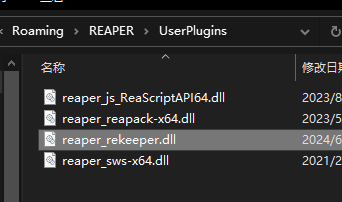
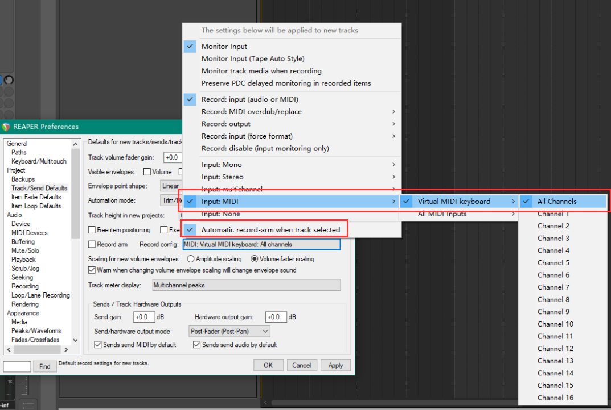
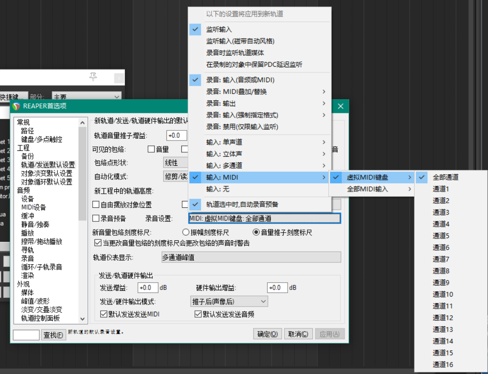

# rekeeper
 
**rekeeper**是一个基于rust开发的reaper虚拟键盘增强插件，可使其如同FL Studio一样，在reaper中直接通过电脑键盘输入MIDI，而无需打开虚拟键盘窗口。

## 功能

- 支持Action激活
- 支持自定义按键映射

## 安装

- 下载[Release](https://github.com/sout233/rekeeper/releases)中的`rekeeper.dll`文件
- 在Reaper中点击菜单栏中的`Options` > `Show REAPER resource path in explorer/finder`
- 将下载的`reaper_rekeeper.dll`文件复制到刚才打开的文件夹中的`UserPlugins`中

- 重启Reaper

## 推荐配置

### 自动激活虚拟键盘录制

- 打开`Options` > `Preferences` > `Project` > `Track/Send Defaults` > `Record config`
- 勾选`Input: MIDI` > `Virtual MIDI keyboard` > `All Channels`
- 勾选`Automatic record-arm when track selected`
- 点击`OK`保存配置

这样在选择轨道时，虚拟键盘会自动激活，并录制所有通道的MIDI。

### 绑定Action

- 打开`Actions` > `Show action list...`
- 为`Rekeeper: Toggle Enable`绑定快捷键
- 点击`OK`保存配置

这样在按下快捷键时，rekeeper会自动激活或关闭，防止与reaper自带快捷键冲突。

> 有时候即使已经聚焦到插件窗口，可能仍然会引发快捷键冲突，可以尝试通过SWS插件来创建一个Cycle，当切换rekeeper激活状态时自动将Action Section切换到其他Alt

## 修改映射

- 打开`Options` > `Show REAPER resource path in explorer/finder`
- 创建`config`文件夹，再在其中创建`rekeeper_key_mapping.json`文件
- 参考[该文件](rekeeper_key_mapping.json)进行修改

## 常见问题

### 为什么我按下了按键，但没有任何反应？

- 检查按键映射是否正确
- 检查Action是否正确绑定，以及rekeeper是否激活